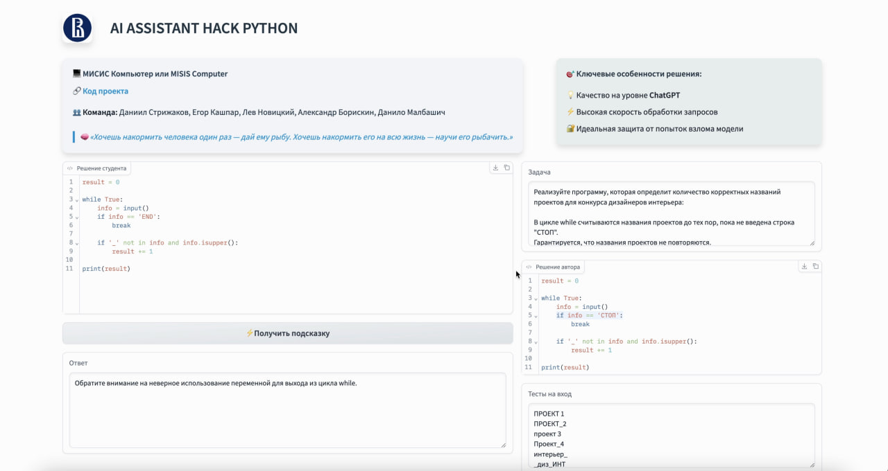

# AI Assistant Hack: Python

## 1. краткое описание проекта

Данный проект представляет собой решение, разработанное в рамках хакатона “HSE AI Assistant Hack: Python”. 

Цель проекта — создание AI-ассистента для анализа и оценки кода студентов, предоставляя обратную связь и выявляя ошибки. Заказщик - Высшая Школа Экономики.

Мы создали систему на основе LLM,  помогающую студентам в изучении алгоритмов программирования. 
Студент, заливший в контест решение задачи с ошибкой получит подсказку от LLM на что ему стоит обратить внимание. Что важно, ассистент не скажет студенту, как именно решать задачу


Необходимо сложить входные файлы в папку `data/test/`, файлы `solutions.xlsx`, `tasks.xlsx`, `tests.xlsx`

Также, необходимо создать папку `/data/processed/`, туда будет записан выходной файл

Решение реализовано через АРI YandexGPT (обученная), для получения секретов писать авторам.

## 2. Установка и запуск проекта

Клонирование репозитория:

`git clone https://github.com/sheep-shaun/HSE-AI-Assistant-Hack.git`

`cd HSE-AI-Assistant-Hack`


Установка зависимостей:

Проект использует Poetry для управления зависимостями. Убедитесь, что Poetry установлен на вашем компьютере. Затем выполните:

`poetry install`

Настройка окружения:
Создайте файл `.env` на основе предоставленного примера:

`cp .env.example .env`

Заполните необходимые переменные окружения в файле `.env`, включая секреты для доступа к API YandexGPT.

Запуск проекта:
Для запуска основного скрипта выполните:

`poetry run python main.py`

Убедитесь, что входные файлы (`solutions.xlsx`, `tasks.xlsx`, `tests.xlsx`) находятся в папке `data/test/`, а папка `data/processed/` существует для сохранения выходных данных.

## 3. Основной функционал проекта

* Анализ кода студентов с использованием модели YandexGPT.
* Выявление ошибок и предоставление обратной связи.
* Защита от инъекций и ранжирование ответов для повышения точности.

## 4. Технологии и инструменты

Языки программирования:
* Python 3.12

Библиотеки и фреймворки:
* YandexGPT
* Pandas
* Levenshtein
* Langchain
* CatBoost

## 5. Команда проекта

* Егор Кашпар [(@sheep-shaun)](https://github.com/sheep-shaun) - Разработка основной логики и интеграция с YandexGPT.

* Александр Борискин [(@sashaboriskin)](https://github.com/sashaboriskin) - Работа с джейлбрейками

* Данило Малбашич [(@denmalbas007)](https://github.com/denmalbas007) - Работа с джейлбрейками

* Лев Новицкий [(@leffff)](https://github.com/leffff) - Алгоритмы для ранжирования ответов

* Даниил Стрижаков [(@triflt)](https://github.com/triflt) - Разработка демо приложения

## 6. Архитектура и структура проекта

```plaintext
HSE-AI-Assistant-Hack/
├── app/
│   ├── __init__.py
│   ├── models/
│   │   ├── __init__.py
│   │   ├── base.py # базовый класс для моделей
│   │   ├── catboost_jailbreak_inference.py # модель CatBoost для jailbreak
│   │   ├── llms.py # другие llm модели для сабмитов
│   │   ├── ranker.py # ранкер ответов
│   │   ├── retriever.py # эксперименты с rag
│   │   └── yandexgpt.py # модель YandexGPT
│   └── utils/
│       ├── __init__.py
│       ├── metric.py # метрики 
│       ├── submit.py # генератор сабмитов
│       ├── code_execute.py # извлечение кода из файлов
│       ├── dataset.py # генератор датасета
│       ├── entities.py # сущности
│       ├── filters.py # фильтры
│       ├── postcheck_regex.py # постчек для проверки ответов
│       ├── prompts.py # системные промпты
│       ├── utils.py # вспомогательные функции
├── data/
│   ├── jailbreaks/ # датасеты для jailbreak
│   ├── test/ # датасеты для тестов
│   └── train/ # датасеты для обучения
├── notebooks/ # ноутбуки для экспериментов
├── tests/ # тесты для проверки сабмита
├── .env.example
├── .gitignore
├── main.py
├── poetry.lock
├── pyproject.toml
└── README.md
```

## 7. Демонстрация работы проекта



## Уникальность решения:
- Решение проработано со всех сторон: от защиты от инъекций до реранкера ответов.
- Можно использовать как API, так и предобученную 8-9b модель
- Высокое качество на лидерборде по метрике (2-е место)
- Высокая скорость ответа всего пайплайна (1.5 - 2 сек)

## 8. Финальный текст-заключение

Данный проект демонстрирует эффективное использование современных AI-технологий для автоматического анализа кода студентов, предоставляя качественную обратную связь и выявляя ошибки. Интеграция с YandexGPT обеспечивает высокую точность и адаптивность системы. В будущем планируется расширить функционал, добавить поддержку других языков программирования и улучшить интерфейс для пользователей.

## 9. Лицензия

Проект распространяется под лицензией MIT.
